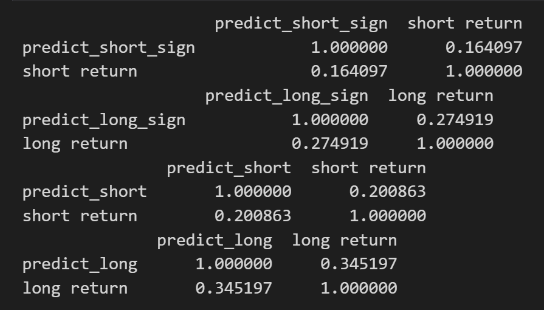
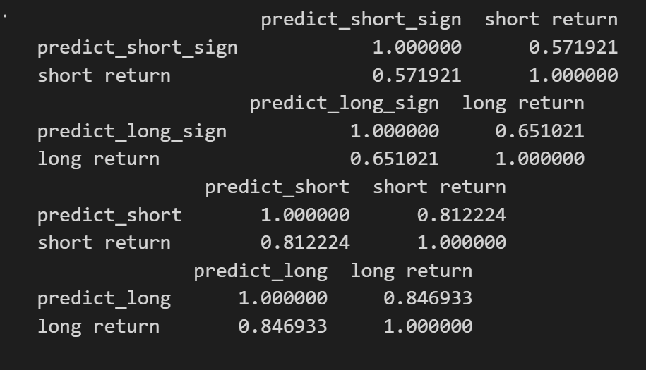
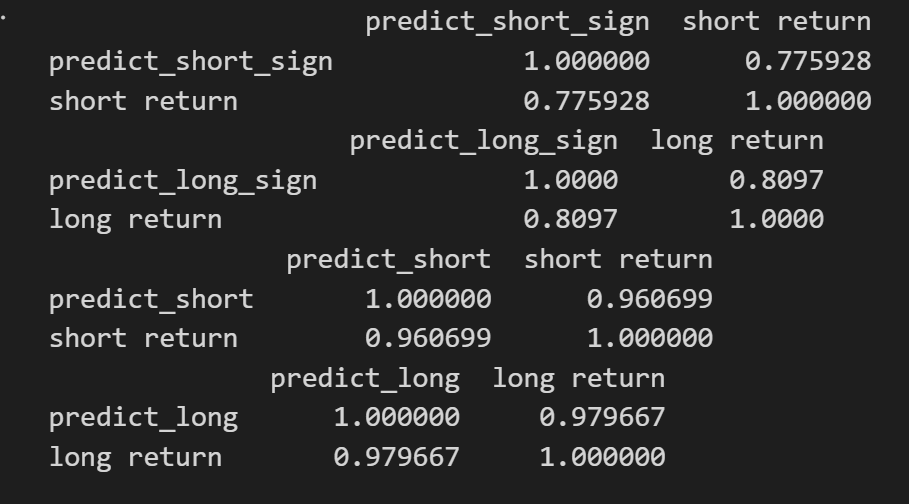
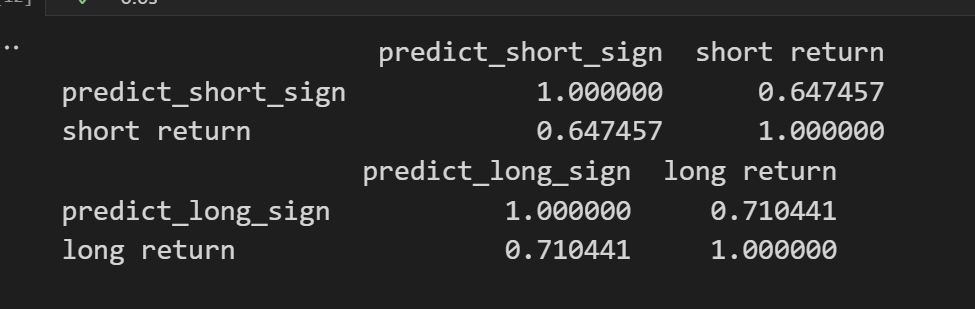

## Futures Trading 
This repository is part of the internship project at Galaxy Derivatives Capital Management Co Ltd. The project aims to develop an RL framework for futures trading using machine learning techniques and financial market data. However, this repository will only contain publicly available information
### Baseline Model
The baseline model is adapted from [Deep Reinforcement Learning for Active High Frequency Trading](https://arxiv.org/pdf/2101.07107.pdf) The following list summarizes the characteristics of the baseline RL model
1. The agent can hold or short at most one unit of the asset (in this case, one lot of futures)
2. State: Each state consists of 21 variables, which include the first 5 bid and ask prices along with their corresponding volumes. Additionally, the state incorporates the position of the agent, (-1 is short position, 0 is no position, and 1 is long position).  
  (bid price 1-5, bid volume 1-5, ask price 1-5, ask volume 1-5, position)
3. Action: The agent is equipped with three actions: short, long, or no action. However, due to the constraint that the agent can only hold or short at most one unit position, taking a short action while already in a short position will not alter its position. Similarly, if the agent decides to take a long action while already in a long position, it will maintain its current position.
4. Reward: the reward at each step is the increment or decrement of cash
5. We employed the clip PPO optimization method. In the baseline model, we utilize a single neural network for both the advantage function and policy. The only distinction lies in the output size, where the policy network yields a size of 3, while the advantage function produces a size of 1.

### Factors relative to returns
There are 33 factors that are relative to future returns, however, one still needs to have the forecasting periods. The following are some notes:
1. The OLS method is not good, even resulting negative correlation.
2. Lasso improved the result a little bit, but still not ideal. Ridge regression, on the other hand, improves the prediction model to another level. 
3. The Random Forest method is the best, but takes way too much time. 
4. Gradient is good, but not as good as ridge regression.

Images1 - 4 are results of Lasso, Ridge, Random Forest, and Gradient Boost respectively
<figcaption>Lasso regression correlation</figcaption>

<figcaption>Ridge regression</figcaption>

<figcaption>Random Forest correlation</figcaption>

<figcaption>Gradient Boost corretion</figcaption>

### RL trading model based on factors
The features used by RL trading model based on factors include predicted short, long returns, and their signs, together with bid-ask prices and volumes. The policy and value networks are 2 layers feed-forward neural networks. The agent can hold or short at most one share of asset. The trading model will take the previous 2500 datapoint to train, and trade for the next 500 datapoints. After 500 datapoints, the trading agent will be retrained twice in order to keep the model up-to-date while still maintaining efficiency. 

### Useful Materials
The followings are some materials that I found useful. Some may be blogs written in Chinese but one can easily find an alternative in English. 
1. [Explanation of TRPO (Chinese)](https://www.zhihu.com/question/366605427/answer/1048153125)
2. [Deepen your Understanding of PPO (Chinese)](https://zhuanlan.zhihu.com/p/614115887)
3. [DeepLOB: Deep Convolutional Neural Networks for Limit Order Books](https://arxiv.org/pdf/1808.03668.pdf)
This paper only uses bid-ask prices and volumes to predict mid-price movement by applying deep learning techniques (CNN-LSTM), use the past 100 snapshots, while each snapshots contain 10 prices level's bid-ask prices and volumes. This paper let CNN to extract features, and use LSTM to summarize those features' temporal dependency.
4. [Benchmark Dataset for Mid-Price Forecasting of Limit Order Book Data with Machine Learning Methods](https://arxiv.org/pdf/1705.03233.pdf), and [Modeling high-frequency limit order book dynamics with support vector machines](https://www.math.fsu.edu/~aluffi/archive/paper462.pdf). Those papers use hand-crafted features to train the model
5. [Random Forest Regression for Time Series Predict](https://www.kaggle.com/code/pbizil/random-forest-regression-for-time-series-predict)
   
